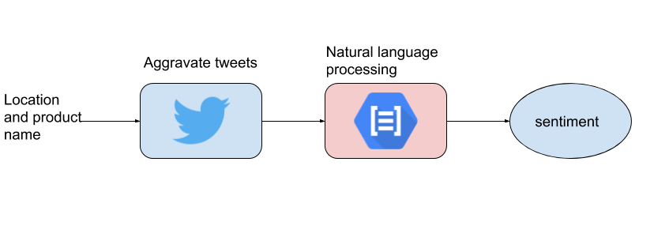
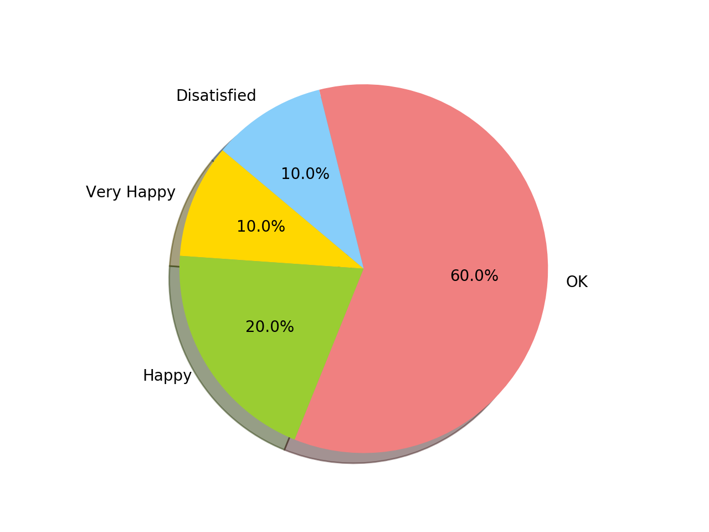

# MiniProject
This is a repository for Mini project of EC601
  
  
  

## Product Mission

### 1) User Story:
As a sales company product manager, I need to understand the attitude of customers on our products on social media(twitter), so we can better improve the quality of our products and services.

### 2) Target Users:
Companies who want to know users' evaluation of their products.

### 3) MVP:

  
  
  

## System Desgin

### 1) Architecture:
 
Get relevant tweets via twitter API and send text to NPL to evaluate their sentiment scores.

### 2) How we address our user story:
In our user story, companies want to understand the evaluation of their products via users' tweets. In this project, after we get sentiments scores from google NLP by inputing users' tweets, we classify all the scores into four satisfactory levels.
<pre>
Sentiment Scores     Sentiment Level
  0.7 ~ 1.0             very happy
  0.3 ~ 0.7              Happy
 -0.3 ~ 0.3               OK
 -0.7 ~ 1.0            Disatified
</pre>
After the sentiment scores being cumulated for a centain amount, we can visualize the outcome by a pie chart, witch presents the propotion of each sentiment level.

  
  
  

## Testing

### 1) Test case (twitter):

### 2) Test case (Google NPL):
To test the google NPL, we randomly select 10 tweets with keyword "#iPhone11" to see how people's feel about the new iPhone. Ten tweets were randonly picked from twitter and imported into the [google_module.py](https://github.com/H40Q1/EC601MiniProject/blob/master/modules/google_module.py). The outcome shows that 6 of these 10 twitter users feel OK, 2 feel happy, 1 feel very happy and the 1 feel disatified. 
 
The visualize the outcome, the results were imported to the [visualize_data.py](https://github.com/H40Q1/EC601MiniProject/blob/master/visualize_data.py). The pie chart below shows the sentiment level distribution of these twitter users. 
 

  
  
  

## Lessons Learned

